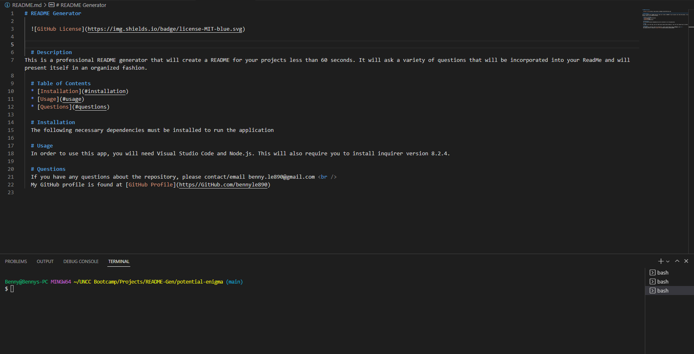

# README Generator

  

  # Description
This is a professional README generator that will create a README for your projects less than 60 seconds. It will ask a variety of questions that will be incorporated into your ReadMe and will present itself in an organized fashion. 

  # Table of Contents
  * [Installation](#installation)
  * [Usage](#usage)
  * [Questions](#questions)
  
  # Installation
  The following necessary dependencies must be installed to run the application

  # Usage
  In order to use this app, you will need Visual Studio Code and Node.js. This will also require you to install inquirer version 8.2.4. Attached below is a photo of Visual Code with an example of the ReadMe before opening in preview. 

  # Questions
  If you have any questions about the repository, please contact/email benny.le890@gmail.com  
  My GitHub profile is found at [GitHub Profile](https//GitHub.com/bennyle890)
